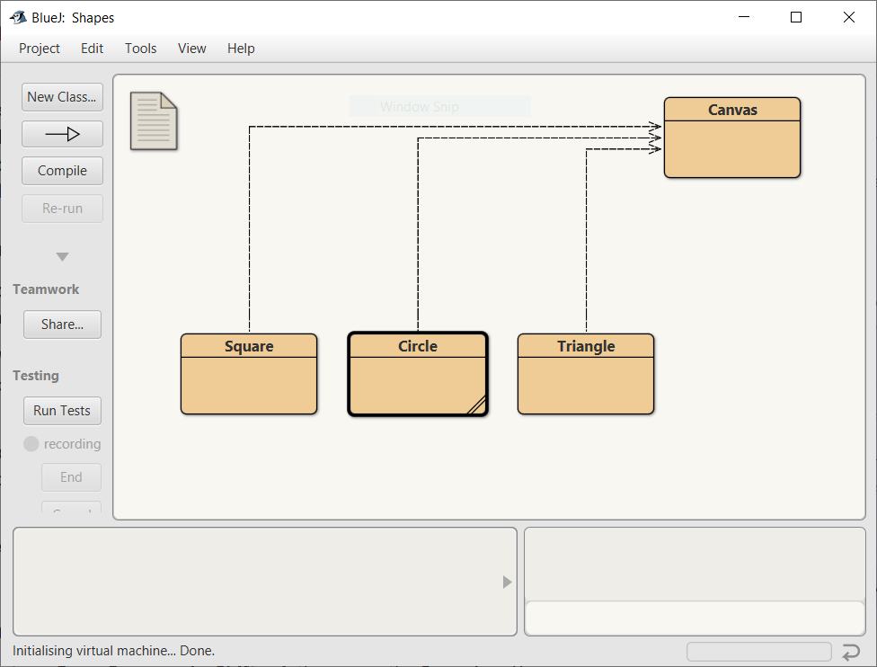
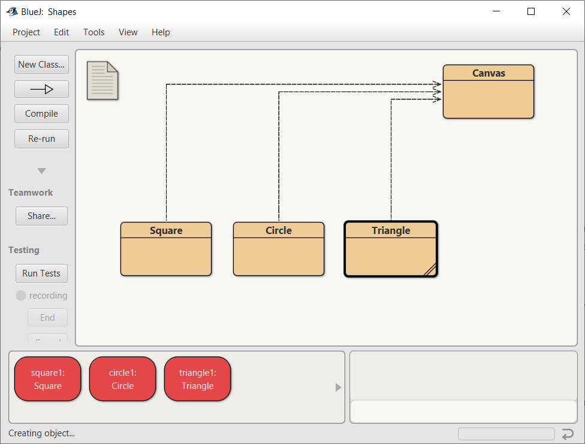
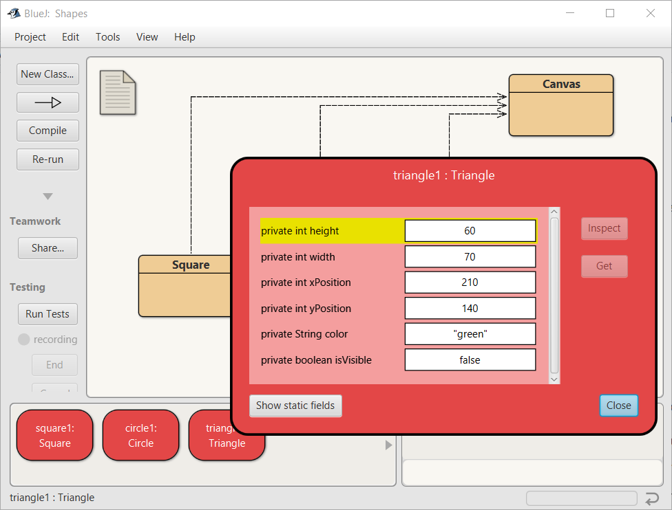

# **📖 Chapter 1: The Visual World of Objects and Classes**

Welcome to Computer Science 1! This year, you are going to learn how to write software using **Java**, one of the most popular programming languages in the world. Java is used to build Android apps, enterprise web servers, and even games like *Minecraft*.

Before we write lines of code, we need to understand *how* Java thinks. Java is an **Object-Oriented Programming (OOP) language**. This means that instead of just writing a long list of math commands, we design virtual "Objects" that interact with each other.

## **🏛️ Classes vs. Objects**

The two most important words in this course are **Class** and **Object**.

Imagine you want to build a neighborhood. You wouldn't just start nailing wood together randomly. First, you need an architect to draw a **Blueprint**. The blueprint isn't a physical house—you can't open its doors or sleep in its bedrooms. It is just a design. However, once you have that blueprint, builders can use it to build as many physical **Houses** as needed.

In Java:

- A **Class** 🗺️ is the Blueprint. It is the code that defines what something is and what it can do.
- An **Object** 🏠 is the physical House. It is the actual, usable thing created from the Class.
- We call the process of building an object **Instantiation** 🏗️ (creating an instance of a class).

> [!NOTE]
> *Analogy Check: If "Cookie Cutter" is the Class, then the "Cookie" is the Object!*

## **💻 The BlueJ Environment**

To write and test our Java code, we use a tool called an **IDE** (Integrated Development Environment) named BlueJ. BlueJ is special because it lets us see our Classes and Objects visually before we start typing code.

### **1. The Class Diagram**

When you open a project in BlueJ, the large main window is the Class Diagram.
You will see tan-colored boxes. Each of these boxes represents a Class (a blueprint) that a programmer has already written for you.

 
*The tan boxes are Classes. Notice the arrows showing how they connect to the Canvas.*

### **2. The Object Bench**

At the bottom of the BlueJ window is a red area called the Object Bench. When you right-click on a tan Class box and select `new`, you are telling Java to *instantiate* an Object. The new Object will appear as a red box on the Object Bench.

 
*The red boxes are Objects. They have been built from the blueprints and exist in the computer's memory.*

## **📦 State and Behavior 🏃‍♂️**

Once you have an Object sitting on your Object Bench, what can you do with it? Every object in Java has two main characteristics: **Behavior** and **State**.

### Behavior (Methods) 🏃

Objects can do things. These actions are called **Methods**. Think of Methods as the "Verbs" of programming.
If you have a `Square` object, its methods might include `moveRight()`, `changeColor()`, or `makeVisible()`. You can tell an object to perform an action by right-clicking the red object box and selecting the method from the menu.

### State (Fields / Variables) 📦

Objects also know things about themselves. This is called the object's **State**, and it is stored in **Variables** (also called Fields). Think of State as the "Adjectives" or "Nouns".
A `Square` object knows its `size`, its `xPosition`, its `yPosition`, and its `color`.

In BlueJ, you can spy on an object's state! If you right-click a red object and select **Inspect**, BlueJ will open a window showing you the exact values saved inside that object's memory.

 
*The Object Inspector reveals the hidden variables (State) stored inside the object.*

# 💾 Welcome to Git: The "Save Game" for Code

In this class, we won't just learn how to code; we will learn how professional engineers manage their projects using a tool called **Git**.

**What is Version Control?**
Have you ever worked on an essay and saved it as `essay_final.docx`? Then you made a change and saved it as `essay_final_v2.docx`? By the end, your folder is a mess of files like `essay_ACTUAL_FINAL_I_SWEAR.docx`.

Git solves this. Git is a **Version Control System**.
Think of Git like the "Save Game" feature in a video game. Instead of making hundreds of copies of your files, Git takes a "snapshot" of your folder at a specific moment in time. If you mess up your code and break your program, you can use Git to travel back in time and load your last working snapshot.

In this course, you will learn the commands to take these snapshots (`git add` and `git commit`), ensuring you never lose your hard work!
